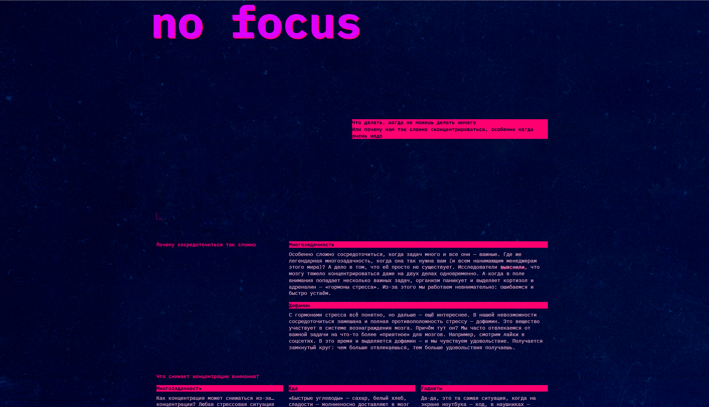

# Сложно сосредоточиться
Проект про то, что делать, когда не можешь делать ничего или почему нам так сложно сконцентрироваться, особенно, когда очень надо.  

---
## Обзор проекта

DEMO Сложно сосредоточиться

  

 Ссылка на макет [Figma](https://www.figma.com/design/lCqDbWjgllgJtb2hmCqfyX/).

---
## Было сделано:
- Cверстан адаптивный сайт.
- Переключение цветовых схем. Поддерживаемые цветовые схемы описаны в метатеге <meta name="color-scheme" content="dark light">.
---
## Стек
HTML, CSS, JavaScript
